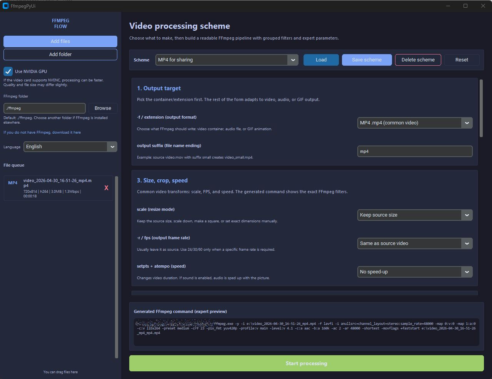

# FfmpegPyUi

**Tired of typing long, fragile FFmpeg commands? Build the command visually, save it as a reusable profile, and get back to processing video, audio, and GIFs faster.**

FfmpegPyUi is a desktop FFmpeg GUI and command configurator for people who need FFmpeg power without rebuilding the same terminal command every time. Drop in media files, choose a workflow scheme, tune the settings, preview the generated FFmpeg command, and run batch processing from a clean Python desktop app.

It works as an FFmpeg command generator, batch video converter, audio extractor, GIF maker, media workflow builder, and quick preset manager in one place.

## Supported Interface Languages

FfmpegPyUi currently includes 14 UI languages:

English, Ukrainian, Russian, Spanish, Italian, German, Korean, Dutch, French, Portuguese, Traditional Chinese, Simplified Chinese, Polish, and Czech.

## Why Use It

FFmpeg is brilliant, but the commands can get noisy fast: codecs, containers, CRF, presets, filters, audio maps, trim windows, crop values, GIF palettes, and hardware encoders all pile up. FfmpegPyUi turns those details into readable controls, while still showing the exact FFmpeg command before it runs.

Use it when you want to:

- Convert videos without memorizing FFmpeg syntax.
- Batch-process multiple media files from one queue.
- Save your own processing profiles and reuse them on the next launch.
- Build video, audio, and GIF workflows from one screen.
- Keep expert control over filters and codec options when you need it.

## Reusable Schemes And Profiles

FfmpegPyUi ships with practical built-in schemes, and every scheme can be loaded, adjusted, and saved under your own name. Saved schemes are stored locally, so a repeat job can become a two-click workflow the next time you open the app.

You can:

- Load a built-in scheme.
- Change output format, codec, filters, trim, crop, audio, speed, and quality.
- Save the tuned setup as a custom scheme.
- Load the same custom scheme after restarting the app.
- Delete custom schemes when you no longer need them.
- Reset back to the default MP4 workflow.

## Built-In Schemes

- **MP4 for sharing**: a safe default for common video sharing and playback.
- **Small file**: HEVC-focused compression for smaller uploads and archives.
- **High quality**: higher quality settings for cleaner exports.
- **Speed up 4x with sound**: accelerate video while keeping audio in sync.
- **Speed up 10x without sound**: fast silent review exports and timelapse-style output.
- **Square for WebGL**: square 720p video output for WebGL-friendly assets.
- **MOV for editing**: MOV output tuned for post-production workflows.
- **WebM for web**: VP9/Opus output for browser delivery.
- **GIF from video**: palette-based animated GIFs from video frames.
- **Audio waveform GIF**: animated waveform GIFs generated from audio.
- **MP3 audio**: quick audio extraction or conversion to MP3.
- **WAV audio**: uncompressed WAV audio export.

## Features

### Input And Batch Workflow

- Add single files from the file picker.
- Add whole folders and scan them recursively.
- Drag and drop files into the queue.
- Pass files as command-line arguments when launching the app.
- Batch-process every queued file with the same workflow settings.
- Remove individual files from the queue.
- Read source metadata with FFprobe: duration, resolution, video codec, audio codec, file size, bitrate, and FPS.

### Supported Media Files

FfmpegPyUi scans common video, audio, and animation files:

- Video input: MP4, AVI, MOV, MKV, WMV, FLV, WebM, MPEG, MPG.
- Audio input: WAV, MP3, AAC, M4A, FLAC, OGG.
- Animation input: GIF.

### Output Formats

- Video containers: MP4, MOV, MKV, WebM.
- Audio formats: MP3, WAV, AAC, FLAC, OGG.
- Animation output: GIF from video frames or audio waveforms.

### Video Encoding Controls

- Choose video codecs: `libx264`, `libx265`, `h264_nvenc`, `hevc_nvenc`, `libvpx-vp9`, `libaom-av1`, or `copy`.
- Use quality profiles: draft, small, balanced, high, maximum.
- Choose encoding speed: fast, balanced, or smaller file.
- Enable NVIDIA NVENC acceleration when your GPU and FFmpeg build support it.
- Keep original resolution, fit to 720p, fit to 1080p, create square 720p output, or set custom width and height.
- Keep source FPS or force 24, 30, or 60 FPS.
- Speed up output by 2x, 4x, 8x, 10x, or 16x.
- Use MP4 and MOV `+faststart` output for friendlier playback and sharing.

### Crop, Trim, And Visual Checks

- Manual crop by left, right, top, and bottom values.
- Interactive visual crop preview using a real frame from the queued video.
- Random-frame crop preview refresh for checking another point in the clip.
- Trim by seconds.
- Trim by frame count using source FPS.
- Visual trim preview with draggable start and end handles.

### Video Filters

- Mirror horizontally with `hflip`.
- Mirror vertically with `vflip`.
- Rotate 90 degrees with `transpose`.
- Convert to grayscale.
- Adjust brightness, contrast, and saturation with `eq`.
- Denoise with `hqdn3d`.
- Sharpen with `unsharp`.
- Deinterlace with `yadif`.
- Pad to square output.
- Add text overlays with `drawtext`.
- Append a raw advanced `-vf` filter chain when the grouped controls are not enough.

### Audio Controls And Filters

- Keep audio, mute output, or create a silent audio track when the source has no audio.
- Choose compact, normal, or high audio bitrate.
- Adjust volume from 0x to 3x.
- Normalize loudness with `loudnorm`.
- Remove low rumble with `highpass`.
- Remove high hiss with `lowpass`.
- Smooth dynamics with `acompressor`.
- Add fade-in with `afade`.
- Trim leading silence with `silenceremove`.
- Append a raw advanced `-af` filter chain for custom audio processing.

### GIF Tools

- Create GIFs from video frames.
- Create animated waveform GIFs from audio using FFmpeg `showwaves`.
- Automatically use video frames when video exists, or audio waveform mode for audio-only sources.
- Configure GIF width and FPS.
- Use palette generation and `paletteuse` for cleaner GIF output.
- Choose dithering: `sierra2_4a`, `bayer`, or no dithering.

### Command Preview And Processing

- Preview the generated FFmpeg command before processing.
- Run FFmpeg in the background without freezing the UI.
- See live console output from FFmpeg.
- Track progress from FFmpeg timestamps when duration is known.
- Stop a running batch.
- Store local app settings outside Git-tracked files.
- Use the bundled `./ffmpeg` folder or choose another FFmpeg installation.
- Fall back to system `ffmpeg` and `ffprobe` when local binaries are not present.

## Requirements

- Python 3.10 or newer.
- FFmpeg and FFprobe.
- Python packages from `requirements.txt`:
  - `customtkinter`
  - `packaging`
  - `tkinterdnd2`

## FFmpeg Setup

By default, the app looks for FFmpeg in:

```text
./ffmpeg
```

That folder is intentionally ignored by Git because FFmpeg binaries are large and platform-specific.

On Windows, this layout works well:

```text
ffmpeg/
  bin/
    ffmpeg.exe
    ffprobe.exe
```

You can also install FFmpeg somewhere else and choose that folder inside the app.

On Linux and macOS, a system FFmpeg from `PATH` can be used. If needed, select the folder manually in the sidebar.

## Installation

### Windows

```bat
setup.bat
```

Or install dependencies manually:

```bat
python -m pip install -r requirements.txt
```

### Linux / macOS

```bash
chmod +x setup.sh run.sh
./setup.sh
```

Or install dependencies manually:

```bash
python3 -m pip install -r requirements.txt
```

## Running

### Windows

```bat
run.bat
```

### Linux / macOS

```bash
./run.sh
```

You can also run the app directly:

```bash
python ffmpegpyui/main.py
```

Files can be passed as command-line arguments:

```bash
python ffmpegpyui/main.py path/to/video.mp4
```

## Typical Workflow

1. Install dependencies.
2. Put FFmpeg in `./ffmpeg` or select your FFmpeg folder in the app.
3. Launch FfmpegPyUi.
4. Drop files into the queue.
5. Pick a built-in scheme or load your saved profile.
6. Adjust output, trim, crop, filters, codecs, speed, and quality.
7. Check the generated FFmpeg command.
8. Start processing.
9. Save the tuned scheme if you will use it again.

## Testing

Run the test suite with:

```bash
python -m unittest discover -s tests
```

## Git Notes

The repository intentionally ignores local state, generated previews, caches, and local FFmpeg binaries:

- `/ffmpeg/`
- `/ffmpegpyui/state.json`
- `/ffmpegpyui/preview_cache/`
- Python caches, virtual environments, build artifacts, coverage files, editor settings, and OS files.

The preview image in this README is referenced with a relative Markdown path:

```markdown

```

GitHub renders repository images reliably when they use relative paths from the README file.
